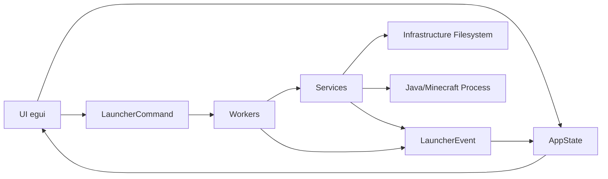

# Minecraft Launcher v3

Desktop Minecraft launcher written in Rust, with a native UI (egui/eframe), resource downloading, and game execution through Java.

## What It Does Today

- Shows a home screen to enter a username.
- Loads the official version list from Mojang.
- Lets you select a version (release, and optionally snapshot).
- Currently supports only Minecraft versions newer than 1.19.
- Lets you configure RAM and other basic launcher options.
- Downloads and validates required components:
  - Version manifest.
  - Client JAR.
  - Libraries.
  - Asset index.
  - Assets.
- Builds JVM arguments and game arguments.
- Launches Minecraft (offline) using `javaw`.
- Displays process logs inside the UI.

## Tech Stack

- Rust (edition 2024)
- UI: `eframe` + `egui`
- Async/runtime: `tokio`
- HTTP: `reqwest`
- Serialization: `serde` + `serde_json`
- Integrity checks: `sha1` + `hex`
- Concurrent downloads: `futures` (`buffer_unordered`)

## Current Architecture (as of today)

The application follows a modular approach, separating state, UI, domain logic, and filesystem access.



### 1) State Layer

`AppState` centraliza:

`AppState` centralizes:

- UI state (`current_screen`, progress, errors, in-memory logs).
- Version state (`loading`, `minecraft_manifest`, `error`).
- Launcher settings (`username`, selected version, RAM, installation path, snapshots).

### 2) UI Layer

Current screens:

- Home: username input and play entry point.
- Launch: version selector, launch button, log panel.
- LaunchSettings: RAM configuration and snapshot toggle.

The UI is reactive, and the main loop processes events on every frame.

### 3) Workers Layer (orchestration)

- `manage_versions_event`: consumes version loading results.
- `launch_commands_manager`: receives launch commands and triggers the main launch flow.
- `launch_events_manager`: consumes launcher events and updates UI-visible state.

Communication is handled via `tokio::sync::mpsc::unbounded_channel` channels.

### 4) Services Layer (domain logic)

- Versions:
  - Downloads Mojang's global `version_manifest.json`.
  - Downloads the selected version manifest.
  - Normalizes modern/legacy manifests into `UnifiedVersionManifest`.
- Launching (`handle_launch`):
  - Orchestrates client, library, and asset download/validation.
  - Builds classpath.
  - Builds JVM args and game args.
  - Starts the Java process.
- Java:
  - Builds arguments according to manifest rules and placeholders.
  - Redirects Minecraft `stdout`/`stderr` into log events.

### 5) Infrastructure Layer

`infrastructure/filesystem` encapsulates disk operations:

- Persistence of version manifest and asset index.
- Client JAR resolution/validation.
- Library resolution/download.
- Asset resolution/download.

## Execution Flow

1. The app starts and registers custom fonts.
2. In parallel:
   - Fetches the global Minecraft versions list.
   - Starts a worker that listens for launch commands.
3. The user selects username/version and clicks play.
4. `LauncherCommand::Launch` is sent.
5. The command worker runs `handle_launch`.
6. `handle_launch` downloads/validates artifacts and builds launch parameters.
7. `javaw` is executed with `main_class` + args.
8. Launcher and Minecraft logs are emitted as `LauncherEvent::Log`.
9. `launch_events_manager` appends those logs to state and the UI renders them.

## Logs

There are currently two main logging planes:

- In-memory logs for UI:
  - Stored in `app_state.ui_state.logs`.
  - Rendered in the Launch screen as a scrollable log view with `[INFO]` label.
  - Include download progress, validations, and Minecraft output (`[MC]`, `[MC ERROR]`).
- Logs persisted by the game/environment:
  - A `logs/` folder exists in the workspace (for example `logs/latest.log`).

Note: the architecture already defines `Started`, `Error`, `Progress`, `Finished` events, but in the current state `Finished` is not emitted when the launch flow completes successfully.

## Project Structure (summary)

- `src/main.rs`: bootstrap, runtime, UI loop, channels.
- `src/app/app_state.rs`: global state and command/event contracts.
- `src/app/ui/`: screens and widgets.
- `src/app/workers/`: event consumption and command processing.
- `src/app/services/`: use cases (versions, launch, java, assets, libraries).
- `src/app/infrastructure/filesystem/`: disk operations and integrity checks.
- `src/app/models/`: data models and manifest unification.
- `assets/`: fonts used by the UI.

## Local Run

Minimum requirements:

- Rust toolchain installed.
- Java 21 available on the system to execute `javaw`.
- Internet connection to download Minecraft metadata/artifacts.

Command:

```bash
cargo run
```

## Current State and Natural Next Improvements

- Handle Mojang/Microsoft online authentication (today it is an offline flow with auth placeholders).
- Emit and use `LauncherEvent::Finished` when the pipeline completes.
- Improve progress modeling (currently accumulated in a simple way).
- Persist launcher logs to a dedicated file explicitly.
- Support Java path configuration and automatic JVM version detection.
